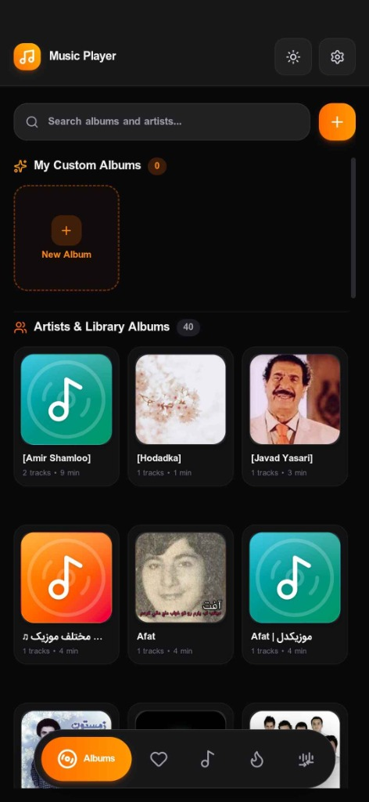
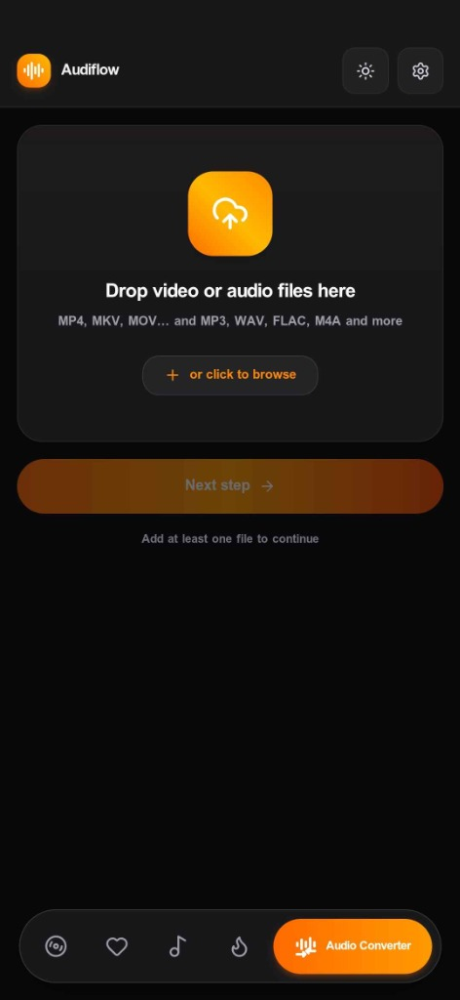
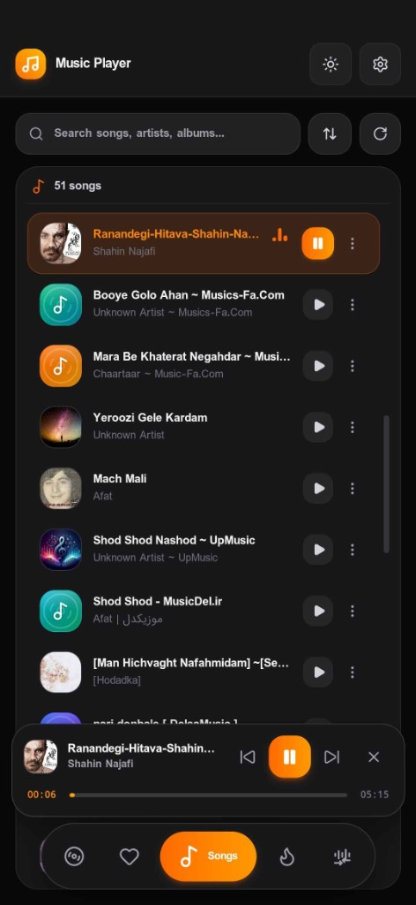

<div align="center">

# 🎧 Audiflow — Free Offline Audio Converter, Editor & Music Player

### Convert, edit, trim, split, boost, and play audio files locally — fast, private, and cross-platform.

**Audiflow** is a free and open-source **offline audio converter, audio editor, and music player** for **Windows, macOS, Linux, and Android**. Convert popular audio formats such as **MP3, FLAC, WAV, AAC, OGG, OPUS, and M4A**, trim audio with a waveform, remove silence automatically, split files, boost volume, and manage your local music library — without uploading your audio files to a server.

<p align="center">
  <a href="https://github.com/javadSharifi/Audiflow/releases/latest">
    <strong>⬇️ Download Audiflow</strong>
  </a>
  ·
  <a href="#-features">
    <strong>Features</strong>
  </a>
  ·
  <a href="#️-see-audiflow-in-action">
    <strong>Screenshots</strong>
  </a>
  ·
  <a href="README.fa.md">
    <strong>🇮🇷 فارسی</strong>
  </a>
</p>

<a href="https://github.com/javadSharifi/Audiflow/releases/latest">
  
</a>


<a href="https://github.com/javadSharifi/Audiflow/releases">
  
</a>

</div>

<br />

<div align="center">
  
</div>

<br />

## 🖥️ See Audiflow in Action

<div align="center">

<table>
  <tr>
    <td align="center">

### 🎵 Music Player



</td>

<td align="center">

### 🔄 Audio Converter



</td>
  </tr>

  <tr>
    <td align="center">

### 🎧 Now Playing



</td>

<td align="center">

### 🔊 Sound Booster


</td>
  </tr>
</table>

</div>

<p align="center">
  <sub>Real screenshots from Audiflow — the interface you get after installation.</sub>
</p>

---

## 🧐 What is Audiflow?

**Audiflow** is a lightweight, free, and open-source **offline audio converter, editor, and music player** for Windows, macOS, Linux, and Android.

It combines an **MP3 converter, FLAC converter, WAV converter, audio trimmer, silence remover, audio splitter, volume booster, and local music player** in one application.

All audio processing runs locally on your device using a bundled **FFmpeg** pipeline, so you can convert and edit audio without uploading files to an online service.

Audiflow is built with **Tauri 2 + Rust** on the backend and **React 19 + TypeScript + Tailwind CSS + Zustand** on the frontend.

### Why Audiflow?

- 🔒 **Private and offline** — your audio stays on your device.
- ⚡ **Fast local processing** — powered by Rust and FFmpeg.
- 🎵 **All-in-one audio toolkit** — convert, trim, split, remove silence, boost volume, and play music.
- 🌍 **Cross-platform** — Windows, macOS, Linux, and Android.
- 🆓 **Free and open source** — built with modern open-source technologies.

---

## ✨ Features

### 🔄 Audio Converter

Convert audio files between popular formats using a local FFmpeg-powered processing pipeline.

- Batch audio conversion
- MP3 conversion
- FLAC conversion
- WAV conversion
- AAC conversion
- M4A conversion
- OGG conversion
- OPUS conversion
- Custom bitrate and quality settings
- Sample-rate and channel configuration
- Queue-based processing
- Per-file progress and status
- Cancel individual conversions
- Automatic media stream validation

Audiflow uses a single FFmpeg processing pipeline where possible to avoid unnecessary intermediate re-encoding.

---

### ✂️ Waveform Audio Trimmer

Edit audio visually with a waveform-based trimming interface.

- Interactive waveform preview
- Precise start and end selection
- Millisecond-level trimming
- Audio preview before export
- Fast local processing
- Useful for songs, podcasts, recordings, lectures, interviews, and audio clips

---

### 🤫 Silence Remover

Automatically detect and remove silent sections from audio files.

- Automatic silence detection
- Configurable silence threshold
- Minimum silence duration
- Non-destructive segment processing
- Useful for podcasts, voice recordings, lectures, interviews, and spoken audio

---

### ✂️ Audio Splitter

Split long audio files into smaller parts.

- Split by duration
- Split by number of parts
- Automatic remainder handling
- Works together with silence removal
- Queue-based processing

---

### 🔊 Sound Booster

Increase audio loudness while helping reduce clipping and distortion.

- Loudness enhancement
- Ready-to-use presets
- Built-in limiter
- Better control over output volume
- Useful for quiet recordings, music, podcasts, and voice files

---

### 🎵 Music Player & Local Library

Use Audiflow as a lightweight local music player.

- Fast local music scanning
- Track, album, and artist organization
- Local music library
- Android MediaStore integration
- Lock-screen media controls
- Hardware media button support
- Standard Android `Music/Audiflow` output directory

---

### 🌍 Cross-Platform User Experience

- 🇬🇧 English interface
- 🇮🇷 Persian interface
- ↔️ Full RTL support
- 🌙 Dark and light themes
- ⚡ Modern responsive interface
- 🖥️ Desktop and mobile support

---

### 🔒 Privacy First

Audiflow is designed around local-first audio processing.

- No audio uploads
- No cloud conversion
- No server-side audio processing
- No dependence on an online converter
- Audio processing happens locally on your device

---

## 🎧 Supported Audio Formats

Audiflow supports common audio formats including:

| Format   | Description             |
| :------- | :---------------------- |
| **MP3**  | Compressed audio        |
| **FLAC** | Lossless audio          |
| **WAV**  | PCM audio               |
| **AAC**  | Advanced Audio Coding   |
| **M4A**  | MPEG-4 audio            |
| **OGG**  | Ogg audio               |
| **OPUS** | Modern compressed audio |

Available encoding options can vary depending on the selected output format and FFmpeg encoder.

---

## 📥 Download Audiflow

Get the latest version of Audiflow for your platform from GitHub Releases.

### 🪟 Windows

**[Download Audiflow for Windows](https://github.com/javadSharifi/Audiflow/releases/latest)**

Windows installer packages are available from the latest release.

### 🍎 macOS

**[Download Audiflow for macOS](https://github.com/javadSharifi/Audiflow/releases/latest)**

Download the latest macOS DMG from GitHub Releases.

### 🐧 Linux

**[Download Audiflow for Linux](https://github.com/javadSharifi/Audiflow/releases/latest)**

Linux AppImage and DEB packages are available when provided in the release.

### 🤖 Android

**[Download Audiflow for Android](https://github.com/javadSharifi/Audiflow/releases/latest)**

Download the latest Android APK from GitHub Releases.

### 📦 All Releases

**[View all Audiflow releases and downloads](https://github.com/javadSharifi/Audiflow/releases)**

---

## 🛠️ Build from Source

Audiflow is open source and can be built locally.

### Prerequisites

- [Node.js](https://nodejs.org/) 20+
- [Rust](https://www.rust-lang.org/tools/install) stable
- [pnpm](https://pnpm.io/) 9+
- Tauri platform dependencies
- FFmpeg build dependencies where required

See the [official Tauri prerequisites guide](https://tauri.app/start/prerequisites/) for platform-specific requirements.

### Clone the Repository

```bash
git clone https://github.com/javadSharifi/Audiflow.git
cd Audiflow
```

### Install Dependencies

```bash
pnpm install
```

### Prepare FFmpeg

```bash
pnpm fetch:ffmpeg
```

### Run in Development

```bash
pnpm tauri dev
```

### Build a Production Release

```bash
pnpm tauri build
```

Build artifacts are generated inside:

```text
src-tauri/target/release/bundle/
```

---

## 🧩 Tech Stack

| Layer                      | Technology      |
| :------------------------- | :-------------- |
| Desktop & Mobile Framework | Tauri 2         |
| Backend                    | Rust            |
| Audio Processing           | FFmpeg 8.1.2    |
| Frontend                   | React 19        |
| Language                   | TypeScript      |
| Styling                    | Tailwind CSS v4 |
| State Management           | Zustand 5       |

---

## 🔐 Privacy & Local Processing

Audiflow is built around local-first audio processing.

Audio files are processed on the user's device instead of being uploaded to an online conversion service.

The application uses a Rust backend and FFmpeg for local media processing.

Unicode and Persian file paths are supported, allowing audio files with non-Latin filenames to be processed locally.

---

## 🤝 Contributing

Contributions, bug reports, feature requests, and improvements are welcome.

### 1. Fork the repository

Fork **[Audiflow on GitHub](https://github.com/javadSharifi/Audiflow)**.

### 2. Create a feature branch

```bash
git checkout -b feature/your-feature
```

### 3. Make your changes

Implement your feature or fix.

### 4. Commit your changes

```bash
git commit -m "Add your feature"
```

### 5. Push your branch

```bash
git push origin feature/your-feature
```

### 6. Open a Pull Request

Submit your pull request on GitHub.

For bugs and feature requests, use the **[Audiflow Issues](https://github.com/javadSharifi/Audiflow/issues)** page.

---

## ⭐ Support Audiflow

If Audiflow is useful to you, consider giving the project a ⭐ on GitHub.

Stars, forks, issues, pull requests, and contributions help the project grow and make it easier for other developers and audio enthusiasts to discover Audiflow.

**[⭐ Star Audiflow on GitHub](https://github.com/javadSharifi/Audiflow)**

---

## ❓ Frequently Asked Questions

### What is Audiflow?

Audiflow is a free and open-source **offline audio converter, editor, and music player** for Windows, macOS, Linux, and Android.

### Is Audiflow an offline audio converter?

Yes. Audiflow processes audio locally using bundled FFmpeg instead of uploading your files to an online conversion service.

### Can Audiflow convert MP3, FLAC, and WAV?

Yes. Audiflow supports popular formats including **MP3, FLAC, WAV, AAC, M4A, OGG, and OPUS**.

### Can I convert FLAC to MP3 with Audiflow?

Yes. Audiflow can convert supported input formats such as FLAC into supported output formats such as MP3.

### Can I convert WAV to MP3?

Yes. WAV files can be converted to MP3 using the audio converter.

### Can I trim audio with Audiflow?

Yes. Audiflow includes a waveform-based audio trimmer for selecting and exporting specific parts of an audio file.

### Can Audiflow remove silence from audio?

Yes. Audiflow includes automatic silence detection and removal with configurable settings.

### Can Audiflow split long audio files?

Yes. Audio can be split by duration or by the desired number of parts.

### Does Audiflow have a volume booster?

Yes. Audiflow includes a sound booster with presets and a built-in limiter.

### Does Audiflow work offline?

Yes. Audio conversion and editing are designed to work locally without requiring an online conversion service.

### Does Audiflow work on Windows, macOS, Linux, and Android?

Yes. Audiflow is designed as a cross-platform application for **Windows, macOS, Linux, and Android**.

### Is Audiflow free?

Yes. Audiflow is free and open source.

---

## 📄 License

Application code and frontend components are licensed under the **MIT License**.

Audiflow bundles **FFmpeg 8.1.2** under the **GNU Lesser General Public License (LGPL) v2.1-or-later**.

See the repository license files for complete licensing information.

---

<div align="center">

## 🎧 Audiflow

### Free Offline Audio Converter, Editor & Music Player

Built with ❤️ by [Javad Sharifi](https://github.com/javadSharifi) for music and audio lovers.

</div>
