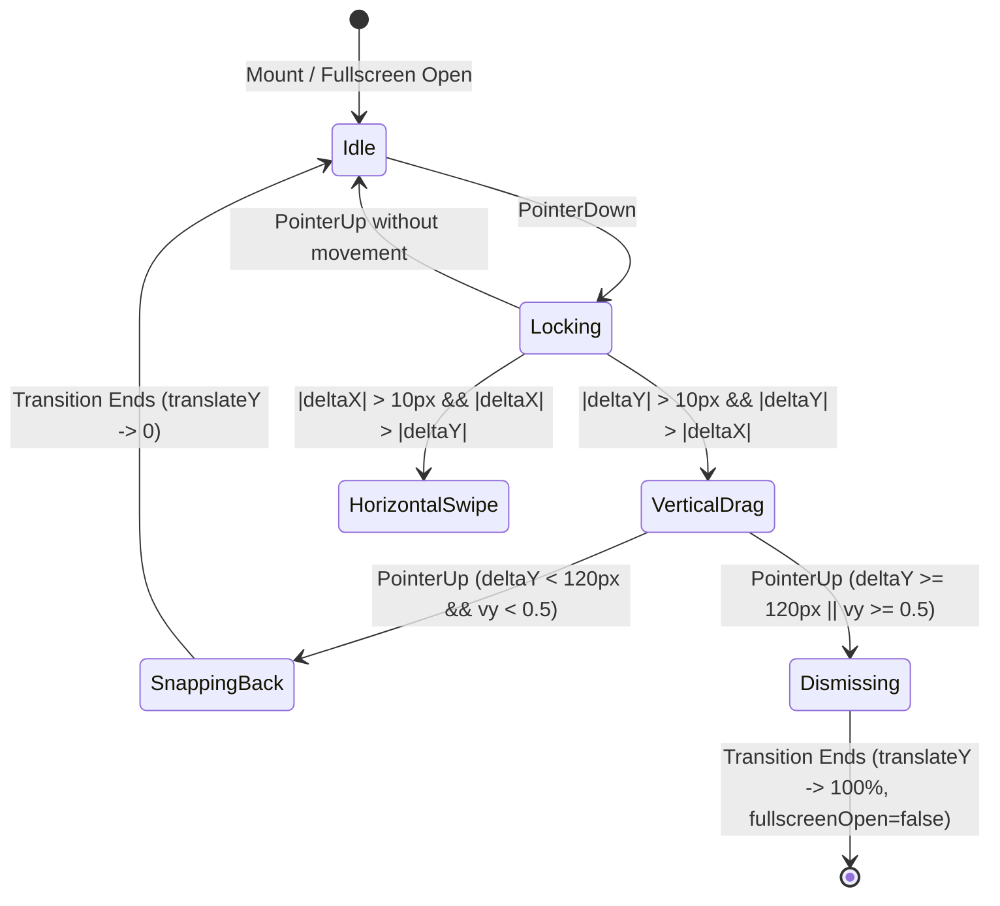
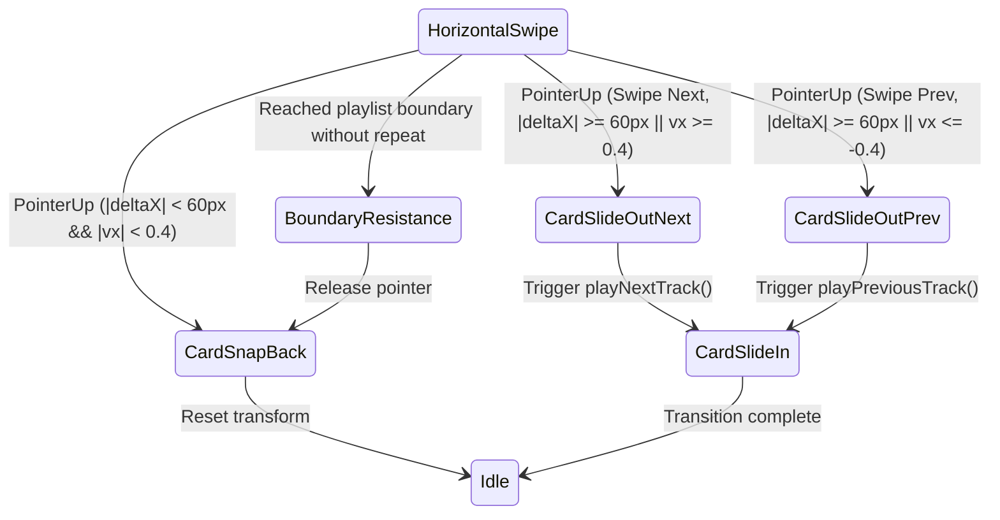

# Data Model & Interaction State: Now Playing Gestures & Artwork

**Feature**: `014-nowplaying-gestures-artwork`  
**Date**: 2026-09-22  
**Status**: Draft

## Overview

This feature coordinates two state machines:
1. **Artwork Presentation State**: Tracking identity, synchronous cache hits, asynchronous extraction, and error fallbacks for audio tracks.
2. **Gesture Interaction State**: Tracking touch/pointer displacement, direction locking (vertical dismiss vs. horizontal track skip), physics curves, and animated transitions.

---

## 1. Entities & Types

### 1.1 Track Identity & Artwork State
Represents the state of an artwork display for a given audio track.

```typescript
interface ArtworkDisplayState {
  /** Canonical track identity (uri || path || id). */
  trackKey: string;
  /** Immediately available synchronous image source or null if pending/none. */
  resolvedSrc: string | null;
  /** True if image loading resulted in error and fallback gradient is active. */
  hasError: boolean;
  /** True while async extraction is in-flight for this trackKey. */
  isLoading: boolean;
}
```

**Validation & Invariants:**
- `trackKey` MUST never be stale: changing the track immediately switches `trackKey`.
- If `resolvedSrc` is pending or null, `resolvedSrc` must NOT display the image from the previous `trackKey`.
- `hasError` is reset to `false` whenever `trackKey` changes.

---

### 1.2 Gesture State Machine

```typescript
type GestureMode = "idle" | "locking" | "vertical-drag" | "horizontal-swipe";

interface GestureState {
  mode: GestureMode;
  /** Initial pointer coordinates. */
  startX: number;
  startY: number;
  /** Current delta from initial touch. */
  deltaX: number;
  deltaY: number;
  /** Calculated velocity in px/ms. */
  velocityX: number;
  velocityY: number;
  /** Timestamp of last move event for velocity calculation. */
  lastTime: number;
  /** Whether the gesture has been committed to a dismissal or track switch. */
  isCommitted: boolean;
}
```

---

## 2. State Transitions

### 2.1 Vertical Drag-to-Dismiss Flow



### 2.2 Horizontal Swipe-to-Skip Flow



---

## 3. Directional & Locale Rules

| Locale / Direction | Swipe Finger Leftward | Swipe Finger Rightward |
| ------------------ | --------------------- | ---------------------- |
| **LTR (`en`)**     | Next Track            | Previous Track         |
| **RTL (`fa`)**     | Next Track            | Previous Track         |

*Note*: In mobile media players (such as Spotify and Apple Music), swiping left consistently advances forward to the next item, while swiping right returns to the previous item, regardless of script direction, because the physical timeline moves forward from right-to-left. To avoid user disorientation, standard forward/backward physical gesture mapping is preserved across all locales while displaying localized labels and RTL layouts.
