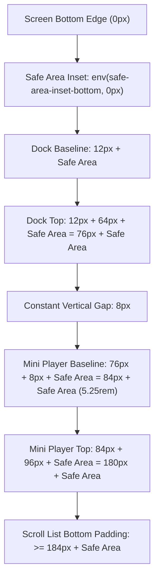

# Data Model & Layout Architecture: Bottom Navigation Layout & Mini Player Spacing

**Feature**: `015-fix-bottom-nav-layout`  
**Date**: 2026-09-22  
**Status**: Completed

---

## 1. Entities & Layout Models

### 1.1 `NavigationDockLayout` (Navigation Bar Container Model)

Represents the floating navigation dock rendered at the bottom of the viewport in `src/components/music-player/MusicPlayerNav.tsx`.

| Property | Type | Description |
| :------- | :--- | :---------- |
| `baselineOffset` | `string` | Calculated CSS offset: `calc(0.75rem + env(safe-area-inset-bottom, 0px))` |
| `dockHeight` | `number` | Total height: `64px` (button 48px + padding 12px + borders 2px) |
| `mobilePadding` | `string` | Horizontal and vertical padding on `< sm` viewports: `p-1.5` (6px) |
| `desktopPadding` | `string` | Padding on `>= sm` viewports: `p-2` (8px) |
| `mobileGap` | `string` | Gap between tabs on `< sm` viewports: `gap-1` (4px) |
| `desktopGap` | `string` | Gap between tabs on `>= sm` viewports: `gap-1.5` (6px) |
| `maxWidth` | `string` | Viewport bounding width: `max-w-[calc(100vw-1.5rem)]` |
| `zIndex` | `number` | Elevation index: `55` (sits above content and below fullscreen player) |

---

### 1.2 `NavigationTabItem` (Tab Button State Model)

Represents each of the 5 destinations within the navigation dock.

| Field | Type | Description |
| :---- | :--- | :---------- |
| `id` | `PlayerTab \| "converter"` | Unique tab key (`"album"` \| `"like"` \| `"songs"` \| `"boost"` \| `"converter"`) |
| `labelKey` | `TranslationKey` | Localized i18n key (`"playerNavAlbums"`, `"playerNavLiked"`, etc.) |
| `icon` | `ComponentType` | SVG Lucide icon component |
| `isActive` | `boolean` | True if the tab is the active view destination |
| `inactiveWidth` | `string` | Mobile: `flex-1 min-w-[38px] max-w-[46px]`, Desktop: `w-auto px-2.5` |
| `activeWidth` | `string` | Mobile: `flex-[1.6] min-w-0 max-w-[130px] px-3`, Desktop: `w-auto px-5` |
| `touchTargetSize`| `string` | Minimum height: `46px` (mobile), `52px` (desktop) |

---

### 1.3 `MiniPlayerPlacement` (Floating Player Card Positioning Model)

Represents the persistent mini player container in `src/components/music-player/MiniPlayer.tsx`.

| Property | Type | Formula / Value |
| :------- | :--- | :-------------- |
| `bottomOffset` | `string` | `calc(5.25rem + env(safe-area-inset-bottom, 0px))` |
| `height` | `number` | ~`96px` (standard card content + seekbar) |
| `zIndex` | `number` | `35` (sits above list content, below navigation dock `z-55`) |
| `verticalGap` | `number` | Strictly `8px` above `NavigationDockLayout.baselineOffset + dockHeight` |
| `maxWidth` | `string` | `max-w-md` (centered horizontally via `left-1/2 -translate-x-1/2`) |

---

### 1.4 `ListViewScrollPadding` (Scroll Clearance Model)

Defines bottom padding applied to virtualized list scrollers (`TrackListView`, `LikedView`, `AlbumDetailView`) so the last track can scroll completely above the floating components.

| State | Bottom Padding Formula | Minimum Clearance |
| :---- | :--------------------- | :---------------- |
| **No Player, Nav Only** | `calc(5.5rem + env(safe-area-inset-bottom, 0px))` | `88px + inset` |
| **Mini Player Active** | `calc(11.5rem + env(safe-area-inset-bottom, 0px))` | `184px + inset` |
| **Selection Mode + Player**| `calc(16rem + env(safe-area-inset-bottom, 0px))` | `256px + inset` |

---

## 2. State & Geometry Relationships

