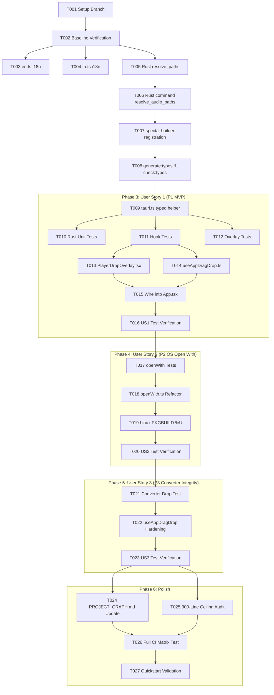

# Tasks: OS "Open With" Context Menu & Drag-and-Drop Audio Playback

**Input**: Design documents from `/specs/019-os-open-drag-playback/`  
**Prerequisites**: `plan.md` ✅, `spec.md` ✅, `research.md` ✅, `data-model.md` ✅, `quickstart.md` ✅, `contracts/ipc-commands.md` ✅  
**Tests**: Mandated by project constitution (Principle V, NON-NEGOTIABLE). All tests written FIRST and verified FAILING before implementation.  
**Organization**: Tasks grouped by phase and user story (US1 = P1 Drag & Drop playback MVP, US2 = P2 OS context menu / Open With, US3 = P3 Converter integrity).

## Format: `[ID] [P?] [Story] Description with file path`

- **[P]**: Can run in parallel (different files, no dependencies)
- **[Story]**: Which user story this task belongs to (`[US1]`, `[US2]`, `[US3]`)

---

## Phase 1: Setup (Shared Infrastructure)

**Purpose**: Verification of baseline environment and branch synchronization

- [X] T001 Create and switch to feature branch `019-os-open-drag-playback` in local git repository
- [X] T002 [P] Verify baseline is green before starting changes: `pnpm check:types`, `pnpm test`, `pnpm build`, `cargo check --manifest-path src-tauri/Cargo.toml`

**Checkpoint**: Clean baseline verified; implementation work can proceed.

---

## Phase 2: Foundational (Blocking Prerequisites)

**Purpose**: Core backend path resolution and shared type-safe IPC contracts that all user stories depend on

**⚠️ CRITICAL**: Must complete before user story implementation begins.

- [X] T003 [P] Add English i18n keys to `src/i18n/en.ts`: `dropToPlay`, `dropToPlaySubtitle`, `playingQueuedTracks`, `noAudioFoundInDrop`
- [X] T004 [P] Add Persian i18n keys to `src/i18n/fa.ts`: Persian translations with RTL fidelity for `dropToPlay`, `dropToPlaySubtitle`, `playingQueuedTracks`, `noAudioFoundInDrop`
- [X] T005 Implement `resolve_paths(paths: Vec<String>) -> Vec<AudioTrackInfo>` in `src-tauri/src/music_library/mod.rs` (handles single/multiple files and directories recursively up to depth 5 using `scanner::scan_local_directory`, filters audio extensions, ignores non-audio files, and sorts tracks in natural alphanumeric order)
- [X] T006 Expose `resolve_audio_paths` command handler in `src-tauri/src/commands/mod.rs` (delegates to `crate::music_library::resolve_paths` via `tauri::async_runtime::spawn_blocking`)
- [X] T007 Register `commands::resolve_audio_paths` in `specta_builder()` in `src-tauri/src/lib.rs`
- [X] T008 Run code generation and verify type synchronization: `pnpm generate:types && pnpm check:types` to update `src/types/generated.ts`
- [X] T009 Add typed IPC wrapper `resolveAudioPaths(paths: string[]): Promise<AudioTrackInfo[]>` to `src/utils/tauri.ts`

**Checkpoint**: Backend path resolution and typed IPC facade complete; foundation ready for user stories.

---

## Phase 3: User Story 1 — Drag and Drop Songs or Folders to Play One by One (Priority: P1) 🎯 MVP

**Goal**: User drags one or more audio files or a folder into the Music Player, files are extracted recursively, the active playback queue is replaced, track 1 plays immediately, and remaining tracks play sequentially via auto-advance.

**Independent Test**: Drag an album folder containing audio files and subfolders into the Music Player. Verify visual drop overlay appears during hover, tracks populate the queue on drop, track 1 begins playing immediately, and track 2 starts automatically when track 1 ends.

### Tests for User Story 1 ⚠️ Write FIRST, confirm FAIL before implementation

- [X] T010 [P] [US1] Unit test for Rust path resolution in `src-tauri/src/music_library/scanner.rs` (or dedicated test in `src-tauri/tests/resolve_paths_test.rs`): tests folder expansion, non-audio file skipping, and natural track order
- [X] T011 [P] [US1] Unit and hook tests for `useAppDragDrop` in `src/hooks/__tests__/useAppDragDrop.test.ts`: tests drag enter/over/leave states, calling player drop handler when `activeTool === 'player'`, and calling `addPaths` when `activeTool === 'converter'`
- [X] T012 [P] [US1] Component tests for `PlayerDropOverlay` in `src/components/music-player/__tests__/PlayerDropOverlay.test.tsx`: tests render visibility, backdrop blur classes, localized title/subtitle rendering, and pointer-events transparency

### Implementation for User Story 1

- [X] T013 [US1] Create visual drop indicator component `src/components/music-player/PlayerDropOverlay.tsx` with smooth fade/scale transitions, backdrop blur, Lucide `Music` icon, and translated copy
- [X] T014 [US1] Create context-aware drag-and-drop hook `src/hooks/useAppDragDrop.ts` listening to Tauri webview `onDragDropEvent` (`enter`, `over`, `drop`, `leave`), tracking `isDraggingOver`, and dispatching to `onPlayerDrop` or `onConverterDrop`
- [X] T015 [US1] Integrate `useAppDragDrop` into `src/App.tsx`: replace legacy 10-line `handleNativeDrop` with `useAppDragDrop`, wire `onPlayerDrop` to `resolveAudioPaths` + `playerStore.playTrack` with toast feedback, and render `<PlayerDropOverlay isVisible={isDraggingOver && activeTool === "player"} />` while maintaining strict file size under 290 lines (ceiling: 300)
- [X] T016 [US1] Confirm T010, T011, and T012 tests now PASS; verify sequential auto-advance execution on dropped queues

**Checkpoint**: User Story 1 (P1 MVP) is complete and independently verifiable. Drag-and-drop audio playback works end-to-end.

---

## Phase 4: User Story 2 — Right-Click Context Menu / "Open with" Playback Across Operating Systems (Priority: P2)

**Goal**: User right-clicks audio files or music folders in macOS Finder, Windows Explorer, or Linux File Manager and selects "Open with Audiflow" (or runs `audiflow path/to/folder`). The app focuses, navigates to the Music Player, queues the tracks, and begins playing immediately.

**Independent Test**: Right-click an audio file or music folder in the OS file manager -> "Open with Audiflow". The application opens/focuses, enters the Music Player, and immediately begins playing the audio track(s).

### Tests for User Story 2 ⚠️ Write FIRST, confirm FAIL before implementation

- [X] T017 [P] [US2] Unit tests for incoming file handler in `src/utils/__tests__/openWith.test.ts`: mock `resolveAudioPaths` and verify `handleIncomingFiles` switches active tool to `player`, queues all resolved tracks, calls `playTrack(tracks[0], tracks)`, and opens fullscreen view

### Implementation for User Story 2

- [X] T018 [US2] Refactor `src/utils/openWith.ts`: update `handleIncomingFilesInner` to route valid paths through `resolveAudioPaths`, seamlessly handling single files, multi-file selections, and directories for immediate music playback
- [X] T019 [US2] Update Linux desktop entry in `packaging/arch/PKGBUILD`: set `Exec=/usr/bin/audiflow %U` and add audio `MimeType` associations (`audio/mpeg;audio/flac;audio/x-wav;audio/vnd.wave;audio/mp4;audio/x-m4a;audio/aac;audio/ogg;audio/opus;audio/aiff;audio/x-aiff;audio/x-ms-wma;audio/webm;inode/directory;`)
- [X] T020 [US2] Confirm T017 tests PASS; verify cold-start queue drain via `api.getPendingOpenFiles()` in `src/App.tsx` correctly starts playback on app launch from OS

**Checkpoint**: User Stories 1 AND 2 are functional and independently testable across desktop operating systems.

---

## Phase 5: User Story 3 — Preserving Converter Drag-and-Drop Integrity (Priority: P3)

**Goal**: Dragging media files into the application while on the Audio Converter tab continues to ingest files into the converter wizard without triggering music playback.

**Independent Test**: Navigate to the Converter tab, drag audio/video files into the window, and verify files appear in the conversion list while the Music Player remains idle.

### Tests for User Story 3 ⚠️ Write FIRST, confirm FAIL before implementation

- [X] T021 [P] [US3] Unit test in `src/hooks/__tests__/useAppDragDrop.test.ts`: verify that when `activeTool === 'converter'`, dropped files invoke `onConverterDrop` and do not invoke `onPlayerDrop` or display `PlayerDropOverlay`

### Implementation for User Story 3

- [X] T022 [US3] Verify and harden tool routing in `src/hooks/useAppDragDrop.ts`: ensure converter drop calls `addPaths` and booster drop routes appropriately, guaranteeing zero regressions in converter workflows
- [X] T023 [US3] Confirm T021 test PASS; run converter wizard test suite (`pnpm test src/components/converter-wizard`) to confirm zero regressions

**Checkpoint**: All three user stories are complete, functional, and verified.

---

## Phase 6: Polish & Cross-Cutting Concerns

**Purpose**: Quality checks, documentation, translations, and architectural compliance

- [X] T024 [P] Update `PROJECT_GRAPH.md` reference index with new files (`src/hooks/useAppDragDrop.ts`, `src/components/music-player/PlayerDropOverlay.tsx`)
- [X] T025 [P] Audit file size ceiling across all touched files (`wc -l src/App.tsx`, `wc -l src/hooks/useAppDragDrop.ts`, etc.) to guarantee 100% compliance with the 300-line ceiling (Constitution Principle VIII)
- [X] T026 Execute full verification test matrix: `pnpm check:types && pnpm lint && pnpm test && pnpm build && cargo test --manifest-path src-tauri/Cargo.toml`
- [X] T027 Validate manual scenarios 1 through 4 from `specs/019-os-open-drag-playback/quickstart.md`

---

## Dependencies & Execution Order

---

## Parallel Execution Opportunities

- **Phase 2 (Foundational)**:
  - `T003` (`en.ts`) and `T004` (`fa.ts`) can be edited in parallel.
  - `T005` (Rust backend) can be written concurrently with i18n keys.
- **Phase 3 (User Story 1 Tests)**:
  - `T010` (Rust tests), `T011` (hook tests), and `T012` (overlay component tests) can be written in parallel before implementation.
- **Phase 3 (User Story 1 Implementation)**:
  - `T013` (`PlayerDropOverlay.tsx`) and `T014` (`useAppDragDrop.ts`) are separate files and can be created in parallel before wiring into `T015` (`App.tsx`).
- **Phase 6 (Polish)**:
  - `T024` (`PROJECT_GRAPH.md`) and `T025` (line ceiling audit) can run in parallel.

---

## Implementation Strategy

### MVP First (User Story 1 Only)
1. Complete Phase 1 (Setup) and Phase 2 (Foundational: Rust command + IPC types).
2. Complete Phase 3 (User Story 1: tests → `PlayerDropOverlay` → `useAppDragDrop` → `App.tsx`).
3. **STOP and VALIDATE**: Test dropping audio files and folders in the Music Player; verify immediate playback and auto-advance. This delivers the core MVP!

### Incremental Delivery
1. After US1 MVP is validated, implement US2 (`openWith.ts` refactor + Linux desktop entry `%U`).
2. Implement US3 (converter drag-and-drop non-regression verification).
3. Execute Phase 6 polish (full CI checks, line count audit, memory sync).
