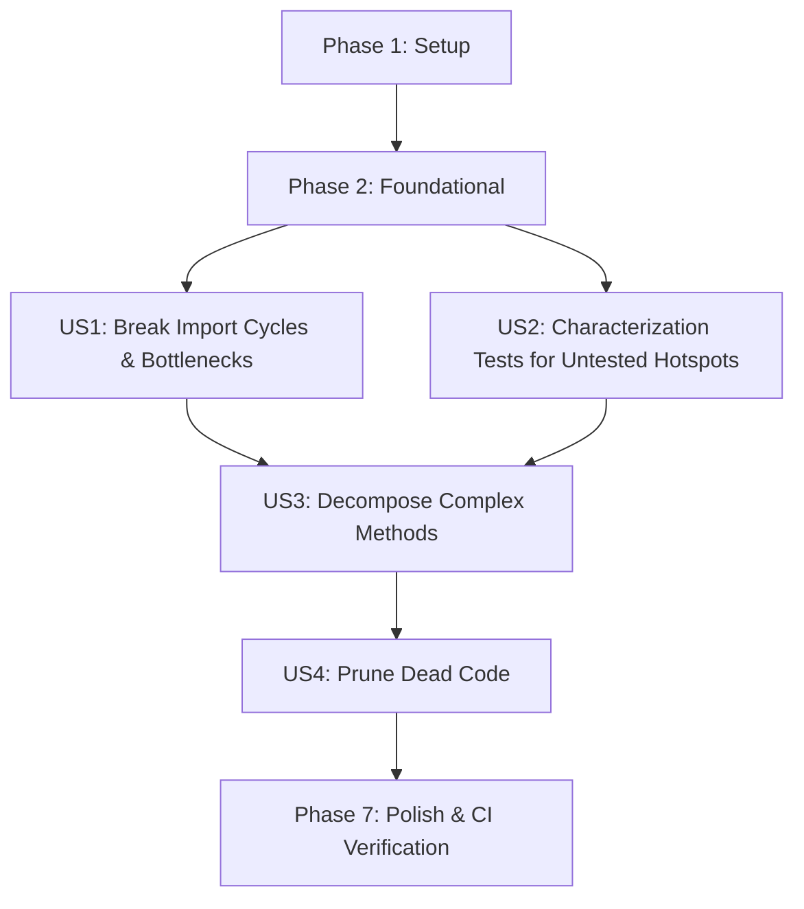

# Tasks: Maximize Code Health & Repowise Score

**Feature**: Maximize Code Health & Repowise Score | **Branch**: `020-maximize-code-health` | **Spec**: [specs/020-maximize-code-health/spec.md](spec.md) | **Plan**: [specs/020-maximize-code-health/plan.md](plan.md)

---

## Phase 1: Setup (Baseline & Quality Tooling)

**Purpose**: Establish test baselines and verify existing code health diagnostics.

- [X] T001 Run baseline verification suite across frontend tests, cargo test, and Specta type check to ensure clean starting state
- [X] T002 [P] Configure circular dependency audit script in `package.json` utilizing `madge`
- [X] T003 [P] Audit baseline cyclomatic complexity across top hotspot files using eslint and clippy

---

## Phase 2: Foundational (Refactoring Guardrails)

**Purpose**: Core interfaces and test harnesses that unblock safe structural refactoring.

**⚠️ CRITICAL**: Must complete before user story refactoring begins.

- [X] T004 Define audio engine listener interface in `src/stores/musicPlayer/types.ts` per contracts
- [X] T005 [P] Define Android playback callback interfaces in `src-tauri/android/PlaybackCallbackContracts.kt`
- [X] T006 [P] Create Rust characterization test harness scaffold in `src-tauri/tests/commands_characterization.rs`

**Checkpoint**: Foundation ready — user story implementation can now begin.

---

## Phase 3: User Story 1 - Eliminate High-Risk Architectural Bottlenecks & Circular Dependencies (Priority: P1) 🎯 MVP

**Goal**: Decouple modules and eliminate all 8 circular import cycles identified by Repowise.

**Independent Test**: Run `npx madge --circular src/` and inspect Kotlin/Rust dependencies; 0 circular dependencies remain and all existing tests pass.

### Implementation for User Story 1

- [X] T007 [P] [US1] Sever circular import in `src/stores/slices/fileSlice.ts` by decoupling direct imports of `useAppStore.ts`
- [X] T008 [P] [US1] Sever circular import in `src/stores/musicPlayer/audioEngine.ts` by using subscriber callbacks instead of importing `useMusicPlayerStore.ts`
- [X] T009 [P] [US1] Break cycle between `src-tauri/android/AudioSessionReceiver.kt` and `src-tauri/android/PlaybackService.kt` using callback interfaces
- [X] T010 [P] [US1] Break cycle between `src-tauri/android/MainActivity.kt` and `src-tauri/android/PlaybackService.kt` using `PlaybackCallbackContracts.kt`
- [X] T011 [P] [US1] Decouple `src-tauri/src/commands/android.rs` from direct cycles with `src-tauri/src/android_fs.rs`
- [X] T012 [P] [US1] Eliminate circular references between `src-tauri/src/queue/mod.rs` and `src-tauri/src/commands/queue.rs`
- [X] T013 [P] [US1] Resolve circular dependency in `src-tauri/src/processing/mod.rs`
- [X] T014 [US1] Extract ScanMemo cache manager class from `src-tauri/src/music_library/scan_memo.rs` to break nested complexity
- [X] T015 [US1] Verify zero circular dependencies remain across frontend and backend using `npx madge --circular src/` and `cargo check`

**Checkpoint**: User Story 1 complete. High-risk structural cycles eliminated.

---

## Phase 4: User Story 2 - Comprehensive Characterization Testing for Critical Untested Hotspots (Priority: P2)

**Goal**: Provide characterization test coverage for the 13 hotspot files with zero test reach.

**Independent Test**: Execute `cargo test` and `pnpm test`; all 13 targeted hotspot files are exercised with passing assertions.

### Implementation for User Story 2

- [X] T016 [P] [US2] Implement unit characterization tests for queue batch enqueueing and cancellation in `src-tauri/tests/queue_characterization.rs`
- [X] T017 [P] [US2] Implement unit characterization tests for IPC command handlers (disk free, settings, audio probe) in `src-tauri/tests/commands_characterization.rs`
- [X] T018 [P] [US2] Add unit characterization tests for JNI path helper logic in `src-tauri/src/android_fs.rs`
- [X] T019 [P] [US2] Add dictionary key parity and missing key unit test in `src/i18n/__tests__/dictionaryParity.test.ts`
- [X] T020 [P] [US2] Add unit tests for type definitions and validator guards in `src/types/__tests__/types.test.ts`
- [X] T021 [P] [US2] Add Android JVM unit tests for playback service notification and builder logic in `src-tauri/gen/android/app/src/test/java/com/audiflow/app/PlaybackServiceUnitTest.kt`
- [X] T022 [US2] Execute full test suites (`cargo test` and `pnpm test`) to confirm 100% passing status across all new test targets

**Checkpoint**: User Story 2 complete. All 13 critical hotspots now covered by automated tests.

---

## Phase 5: User Story 3 - Decompose High-Complexity & Brain Methods (Priority: P3)

**Goal**: Break down methods with cyclomatic complexity > 10 into cohesive, testable helpers.

**Independent Test**: Cyclomatic complexity audit verifies no single function in the target files exceeds complexity threshold <= 8.

### Implementation for User Story 3

- [X] T023 [P] [US3] Extract sub-filtergraph builders (`build_trim_filter`, `build_boost_filter`) from `src-tauri/src/processing/pipeline.rs` into focused helper functions
- [X] T024 [P] [US3] Extract sub-views and player state render helpers from `src/components/music-player/MusicPlayerView.tsx` into `src/components/music-player/MusicPlayerStatusView.tsx`
- [X] T025 [P] [US3] Decompose format decoding branches in `src/components/waveform/audioSource.ts` into individual format decoder strategies
- [X] T026 [P] [US3] Refactor nested conditionals in `src/stores/musicPlayer/trackUtils.ts` into lookup tables and early exits
- [X] T027 [P] [US3] Simplify waveform canvas rendering branches in `src/components/waveform/renderer.ts`
- [X] T028 [US3] Verify DSP pipeline audio output identicalness and terminal `-0.5 dBFS` limiter preservation using `src-tauri/tests/e2e.rs`

**Checkpoint**: User Story 3 complete. High-complexity methods successfully decomposed.

---

## Phase 6: User Story 4 - Prune Dead Code & Dormant Exports (Priority: P4)

**Goal**: Eliminate confirmed dead code, unused exports, and orphan functions.

**Independent Test**: Build and test suites pass cleanly with dead code removed and no broken imports.

### Implementation for User Story 4

- [X] T029 [P] [US4] Remove confirmed dead code in `.agents/gen_graph.py`
- [X] T030 [P] [US4] Audit and prune unused internal exports in `src/types/index.ts`
- [X] T031 [P] [US4] Prune unused helper methods in `src-tauri/src/music_library/artwork.rs`
- [X] T032 [US4] Run full TypeScript typecheck (`pnpm build`) and Rust compiler check (`cargo check --all-targets`) to ensure zero broken references

**Checkpoint**: User Story 4 complete. Codebase pruned and lean.

---

## Phase 7: Polish & Cross-Cutting Concerns

**Purpose**: End-to-end quality validation, constitution compliance check, and shared memory updates.

- [X] T033 Verify that all modified files strictly comply with the <= 300 lines ceiling (Constitution Principle VIII)
- [X] T034 [P] Execute quickstart validation guide in `specs/020-maximize-code-health/quickstart.md`
- [X] T035 [P] Run full CI verification suite: `pnpm test`, `cargo test`, `pnpm check:types`
- [X] T036 Update `PROJECT_GRAPH.md` and `DECISIONS.md` with the refactored architecture and cycle-breaking patterns

---

## Dependencies & Execution Order

### Phase Dependencies

- **Setup (Phase 1)**: Independent — runs first.
- **Foundational (Phase 2)**: Depends on Phase 1 — blocks all user stories.
- **US1 (Phase 3)**: Depends on Phase 2. MVP core.
- **US2 (Phase 4)**: Depends on Phase 2; can execute in parallel with or right after US1.
- **US3 (Phase 5)**: Depends on US1 (to avoid merge conflicts in decoupled files) and US2 (tests protect refactor).
- **US4 (Phase 6)**: Depends on US3.
- **Polish (Phase 7)**: Depends on all user stories being complete.

### User Story Dependencies

### Parallel Opportunities

- Within Phase 1: T002, T003 can execute in parallel.
- Within Phase 2: T005, T006 can execute in parallel.
- Within Phase 3 (US1): T007, T008, T009, T010, T011, T012, T013 touch different files and can run in parallel.
- Within Phase 4 (US2): T016, T017, T018, T019, T020, T021 touch independent test harnesses and can run in parallel.
- Within Phase 5 (US3): T023, T024, T025, T026, T027 touch independent modules and can run in parallel.

---

## Implementation Strategy

### MVP First (User Story 1 Only)
1. Complete Phase 1 & 2.
2. Complete Phase 3 (US1): Eliminate the 8 structural circular dependency cycles.
3. Validate: `npx madge --circular src/` and `cargo check`.
4. Deploy / commit MVP increment.

### Incremental Delivery
1. Foundation & US1 (Structural Fixes) → Re-index in Repowise (cycles cleared).
2. US2 (Characterization Tests) → Re-index in Repowise (untested hotspots cleared).
3. US3 (Complexity Decomposition) → Re-index in Repowise (maintainability & complexity scores rise).
4. US4 (Dead Code Pruning) & Polish → Code Health score maximized in Good/Excellent band (9.0+).
