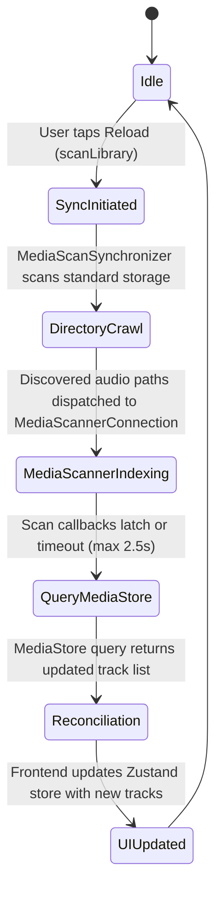

# Phase 1 Data Model: Android Media Rescan & Indexing Sync

## Entities

### 1. AudioTrackInfo (Existing Model, Preserved)
Represents a playable track in the music player library across desktop and mobile platforms.

| Field | Type | Description |
|---|---|---|
| `id` | `String` | Stable unique track identifier (`android_<mediaStoreId>` on Android, or hash on desktop) |
| `uri` | `String` | Playback URI (e.g. `content://media/external/audio/media/12345` or `file:///...`) |
| `path` | `Option<String>` | Direct filesystem path if readable and accessible, else null |
| `name` | `String` | File name with extension (e.g. `song.mp3`) |
| `title` | `String` | Track title from metadata, falling back to name |
| `artist` | `Option<String>` | Artist name from metadata, or null |
| `album` | `Option<String>` | Album name from metadata, or null |
| `durationSecs` | `f64` | Track duration in seconds |
| `sizeBytes` | `u64` | File size in bytes |
| `mimeType` | `String` | MIME type (e.g. `audio/mpeg`, `audio/flac`) |
| `format` | `String` | Audio format extension (e.g. `mp3`, `flac`) |
| `createdTimestampMs` | `u64` | Added timestamp in epoch milliseconds |
| `modifiedTimestampMs` | `u64` | Modified timestamp in epoch milliseconds |
| `coverUrl` | `Option<String>` | Album art content URI or cached image path, or null |

### 2. MediaScanTarget (Internal Kotlin Entity)
Represents an audio file candidate discovered on disk to be submitted to `MediaScannerConnection`.

| Field | Type | Description |
|---|---|---|
| `file` | `File` | File handle on device storage |
| `path` | `String` | Absolute path string for MediaScanner registration |
| `extension` | `String` | Lowercased file extension (`mp3`, `m4a`, `flac`, etc.) |

### 3. MediaScanSyncResult (Internal Kotlin Entity)
Represents the result of a batch indexing synchronization run.

| Field | Type | Description |
|---|---|---|
| `scannedFilesCount` | `Int` | Number of audio files passed to `MediaScannerConnection` |
| `indexedFilesCount` | `Int` | Number of files successfully indexed with returned content URIs |
| `durationMs` | `Long` | Elapsed time in milliseconds for the scan pass |
| `timedOut` | `Boolean` | True if latch timeout was reached before all callbacks completed |

## State Transitions & Flow

