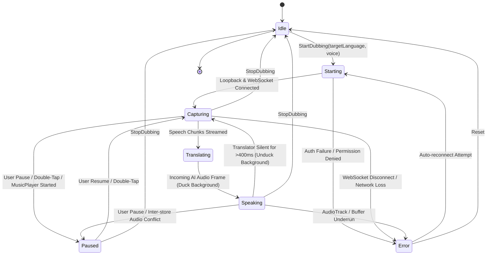

# Data Model: Real-Time AI Live Audio Dubbing

**Feature**: `023-live-audio-dubbing`  
**Date**: 2026-09-26  
**Status**: Completed  

---

## 1. Entities & Data Structures

### `DubbingSessionState` (Enum)
Represents the current lifecycle state of the live dubbing session:

```typescript
export type DubbingSessionState = 
  | "idle"          // Not running; resources released
  | "starting"      // Initializing audio capture & authenticating WebSocket
  | "capturing"     // Capturing system audio; streaming to Gemini
  | "translating"   // Gemini is processing speech
  | "speaking"      // AI audio output playing; background ducking active
  | "paused"        // Session suspended by user (audio capture muted)
  | "error";        // Encountered network or permission error
```

---

### `LanguageProfile` (Entity)
Represents one of the 78 supported translation languages:

| Field | Type | Description | Example |
|---|---|---|---|
| `code` | `string` | BCP-47 / ISO language code | `"fa"`, `"en"`, `"de"`, `"ja"` |
| `nameEn` | `string` | Localized English name | `"Persian"` |
| `nameFa` | `string` | Localized Persian name | `"فارسی"` |
| `flagEmoji` | `string` | Visual country/region indicator | `"🇮🇷"`, `"🇺🇸"`, `"🇩🇪"` |
| `isRtl` | `boolean` | RTL presentation flag | `true` |
| `availableVoices` | `VoicePersona[]` | Compatible AI vocal personas | `["Puck", "Fenrir", "Aoede", "Kore"]` |

---

### `VoicePersona` (Enum)
Available synthesized voice personalities from the Gemini Live voice library:

```typescript
export type VoicePersona = "Puck" | "Charon" | "Kore" | "Fenrir" | "Aoede";
```

---

### `AudioDuckingConfig` (Entity)
Settings controlling background audio attenuation during speech playback:

| Field | Type | Constraints | Description |
|---|---|---|---|
| `enabled` | `boolean` | Default: `true` | Toggle ducking behavior on/off |
| `duckingPercent` | `number` | `30` to `90`, Default: `70` | Percentage by which background audio volume is attenuated |
| `attackRampMs` | `number` | Default: `100` | Smooth transition time into ducked state (prevents audio pops) |
| `releaseRampMs`| `number` | Default: `400` | Smooth transition time back to 100% volume after silence |

---

### `FloatingOverlayConfig` (Entity)
Settings governing the on-screen floating pill controller:

| Field | Type | Constraints | Description |
|---|---|---|---|
| `enabled` | `boolean` | Default: `true` | Whether floating overlay is enabled when app is backgrounded |
| `snapToEdge` | `boolean` | Default: `true` | Automatically snaps pill to left or right screen border |
| `hapticFeedback` | `boolean` | Default: `true` | Vibrates device on double-tap or toggle |
| `showHalo` | `boolean` | Default: `true` | Pulsing neon ring indicates active speech translation |

---

### `DubbingSession` (Aggregate Root)
Runtime telemetry and state of an active dubbing session:

| Field | Type | Description |
|---|---|---|
| `sessionId` | `string` | Unique UUID of the active session |
| `state` | `DubbingSessionState` | Current execution state |
| `targetLanguage` | `string` | Selected language code (`"fa"`) |
| `selectedVoice` | `VoicePersona` | Selected voice persona (`"Aoede"`) |
| `duckingConfig` | `AudioDuckingConfig` | Active ducking parameters |
| `overlayConfig` | `FloatingOverlayConfig` | Active overlay settings |
| `latencyMs` | `number` | Estimated round-trip streaming latency in milliseconds |
| `bytesCaptured` | `number` | Total PCM bytes captured from system loopback |
| `bytesSynthesized` | `number` | Total PCM bytes received and played back |
| `errorMessage` | `string | null` | Human-readable error message if state is `"error"` |

---

## 2. State Machine Diagram



---

## 3. Validation Rules

1. **Target Language**: Must match one of the 78 supported `LanguageProfile` entries.
2. **Ducking Percent**: Must be clamped within `30%` and `90%` inclusive; values outside are rejected or coerced.
3. **API Key Presence**: Session cannot transition to `Starting` unless a non-empty Gemini API key is present in the secure credential store.
4. **Single Stream Invariant**: If `useMusicPlayerStore` state changes to `"playing"`, `DubbingSession` must transition immediately to `Paused`.
