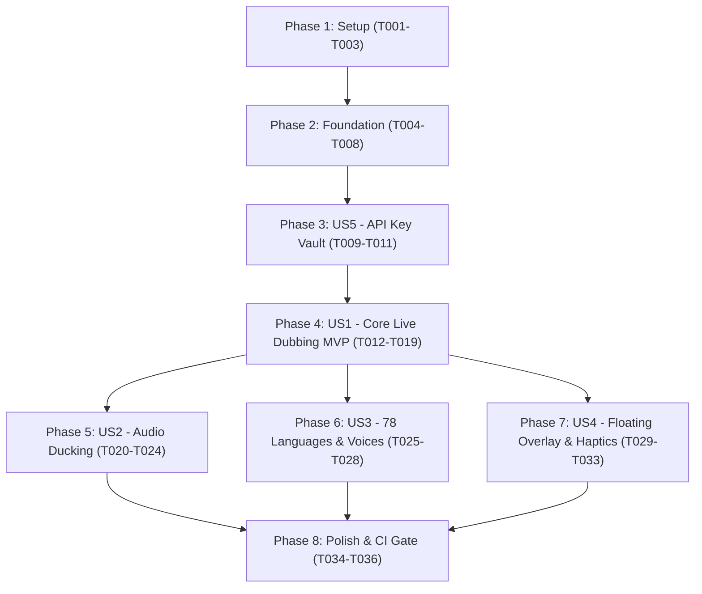

# Tasks: Real-Time AI Live Audio Dubbing (ALAD Integration)

**Input**: Design documents from `specs/023-live-audio-dubbing/`  
**Prerequisites**: `plan.md`, `spec.md`, `research.md`, `data-model.md`, `contracts/live-dubbing-contract.md`, `quickstart.md`  
**Organization**: Tasks are grouped by phase and user story to enable independent implementation, testing, and MVP delivery.

---

## Format: `[ID] [P?] [Story] Description`
- **[P]**: Parallelizable task (different files, no blocking dependencies)
- **[Story]**: Target user story tag (`[US1]` to `[US5]`)
- All task descriptions include exact file paths

---

## Phase 1: Setup (Shared Infrastructure)

**Purpose**: Establish backend module structure, dependencies, and shared loopback capture traits.

- [X] T001 Create backend module directory structure in src-tauri/src/live_dubbing/
- [X] T002 Add tokio-tungstenite, cpal, base64, and windows dependencies in src-tauri/Cargo.toml
- [X] T003 [P] Define SystemAudioCapturer trait and 16kHz PCM audio chunk resampler in src-tauri/src/live_dubbing/audio_capture.rs

---

## Phase 2: Foundational (Blocking Prerequisites)

**Purpose**: Core data structures, Specta IPC bindings, and store slices required by all user stories.

**⚠️ CRITICAL**: Must complete before user story implementation begins.

- [X] T004 Define DubbingSessionState, LanguageProfile, AudioDuckingConfig, and LiveDubbingStatus structs with Specta/Serde in src-tauri/src/live_dubbing/types.rs
- [X] T005 Implement Specta IPC command handlers and register live_dubbing commands in src-tauri/src/live_dubbing/mod.rs and src-tauri/src/lib.rs
- [X] T006 Run pnpm generate:types and create typed IPC wrapper helpers in src/utils/tauri.ts
- [X] T007 [P] Add English and Persian localization keys with RTL support in src/i18n/en.ts and src/i18n/fa.ts
- [X] T008 Create liveDubbingSlice.ts Zustand slice under 300 lines in src/stores/slices/liveDubbingSlice.ts and mount into src/stores/useAppStore.ts

**Checkpoint**: Foundation ready — user story implementation can begin.

---

## Phase 3: User Story 5 - Secure Credential Management & Health Preflight (Priority: P1)

**Goal**: Save Google Gemini API key securely into OS Keychain / Android Keystore (Constitution Principle VII) and perform connection health checks.  
**Independent Test**: Enter Gemini API key, click "Test Connection", observe verified status, and confirm key is stored in OS keychain with zero plaintext leakage in localStorage or settings.json.

- [X] T009 [US5] Implement Gemini API key validation and keychain storage via src-tauri/src/secrets.rs in src-tauri/src/live_dubbing/mod.rs
- [X] T010 [P] [US5] Create ApiKeyCard.tsx with secure password input, "Test Connection" button, and status indicator in src/components/live-dubbing/ApiKeyCard.tsx
- [X] T011 [US5] Add unit tests for API key verification and storage in src/stores/__tests__/liveDubbingKey.test.ts

**Checkpoint**: User Story 5 complete — secure credential management operational.

---

## Phase 4: User Story 1 - Real-Time System Audio Capture & AI Live Speech Dubbing (Priority: P1) 🎯 MVP

**Goal**: Capture internal system audio, stream 16kHz PCM to Gemini Live Bidi WebSocket, and play back translated speech in real time (< 1.5s latency).  
**Independent Test**: Start Live Dubbing with Persian selected, play an English video in a browser, and confirm clear translated Persian speech plays through audio output within 1.5s.

- [X] T012 [P] [US1] Implement Windows WASAPI Loopback capturer (16kHz 16-bit Mono PCM) in src-tauri/src/live_dubbing/platform_windows.rs
- [X] T013 [P] [US1] Implement Android AudioPlaybackCapture and AudioRecord pipeline in src-tauri/android/AudioCaptureManager.kt
- [X] T014 [US1] Implement JNI bridge in src-tauri/src/live_dubbing/android_bridge.rs forwarding Android PCM chunks to Rust engine
- [X] T015 [US1] Implement Gemini Live Bidi WebSocket client (tokio-tungstenite) in src-tauri/src/live_dubbing/client.rs
- [X] T016 [US1] Implement real-time PCM audio playback stream with low-latency buffer in src-tauri/src/live_dubbing/player.rs
- [X] T017 [US1] Implement single-stream mutual pause (Principle VI) pausing dubbing on music player start in src/stores/slices/liveDubbingSlice.ts
- [X] T018 [US1] Create primary dashboard LiveDubbingPanel.tsx with start/stop buttons and latency indicator in src/components/live-dubbing/LiveDubbingPanel.tsx
- [X] T019 [US1] Add unit tests for live dubbing state machine transitions in src/stores/__tests__/liveDubbingSlice.test.ts

**Checkpoint**: User Story 1 complete — core MVP live dubbing functional.

---

## Phase 5: User Story 2 - Smart Dynamic Audio Ducking (Priority: P1)

**Goal**: Automatically attenuate background media audio (30%-90% user configurable) during active translation speech, and restore volume when speech ends.  
**Independent Test**: Play a loud video, verify background volume dips smoothly within 100ms when translated speech starts and recovers smoothly within 400ms after speech ceases.

- [X] T020 [P] [US2] Implement dynamic session ducking for Windows (IAudioSessionControl) in src-tauri/src/live_dubbing/ducking_windows.rs
- [X] T021 [P] [US2] Implement Android AudioManager focus/ducking in src-tauri/android/DubbingService.kt
- [X] T022 [US2] Implement speech detection trigger and smooth attack (100ms) / release (400ms) ramp in src-tauri/src/live_dubbing/ducking.rs
- [X] T023 [P] [US2] Create DuckingSlider.tsx component with 30%-90% range in src/components/live-dubbing/DuckingSlider.tsx
- [X] T024 [US2] Add unit test for ducking ramp calculations in src-tauri/src/live_dubbing/ducking.rs

**Checkpoint**: User Story 2 complete — dynamic audio ducking fully operational.

---

## Phase 6: User Story 3 - Multi-Language Selection (78 Languages) & Voice Customization (Priority: P2)

**Goal**: Provide searchable language picker for 78 languages with country flags and localized names, plus vocal persona selection.  
**Independent Test**: Search and select Persian or German in the language modal, choose voice persona (Aoede), and confirm translated speech adopts selected language and persona.

- [X] T025 [P] [US3] Create static dictionary of 78 supported languages with localized en/fa names and flag emojis in src/components/live-dubbing/languages.ts
- [X] T026 [US3] Create searchable LanguagePickerModal.tsx under 300 lines in src/components/live-dubbing/LanguagePickerModal.tsx
- [X] T027 [P] [US3] Create VoicePersonaSelect.tsx with voice personas (Puck, Aoede, Fenrir, etc.) in src/components/live-dubbing/VoicePersonaSelect.tsx
- [X] T028 [US3] Add unit test for language search filter in src/components/live-dubbing/__tests__/LanguagePicker.test.tsx

**Checkpoint**: User Story 3 complete — multi-language and voice selector operational.

---

## Phase 7: User Story 4 - Smart Floating Overlay Controller with Haptic Gestures (Priority: P2)

**Goal**: Provide an opt-in floating overlay pill on Android and Desktop with edge-snapping, double-tap pause/resume gesture, and haptic feedback.  
**Independent Test**: Toggle Floating Overlay on, start dubbing, switch apps, double-tap the floating pill, and verify dubbing toggles with haptic vibration.

- [X] T029 [P] [US4] Implement Android FloatingOverlayView.kt with WindowManager, edge-snapping drag, and double-tap gesture in src-tauri/android/FloatingOverlayView.kt
- [X] T030 [P] [US4] Implement Android haptic feedback vibration in FloatingOverlayView.kt
- [X] T031 [US4] Implement Desktop secondary floating pill window in src-tauri/src/live_dubbing/overlay.rs
- [X] T032 [P] [US4] Create FloatingOverlayToggle.tsx settings switch in src/components/live-dubbing/FloatingOverlayToggle.tsx
- [X] T033 [US4] Add unit tests for overlay visibility toggles in src/stores/__tests__/liveDubbingOverlay.test.ts

**Checkpoint**: User Story 4 complete — floating overlay pill with gestures and haptics operational.

---

## Phase 8: Polish & Cross-Cutting Concerns

**Purpose**: App navigation integration, strict 300-line ceiling verification, and CI test gates.

- [X] T034 Mount Live Dubbing tab/navigation link in main sidebar/header in src/App.tsx
- [X] T035 Verify all new .ts, .tsx, and .rs files satisfy strict 300-line ceiling per Constitution Principle VIII
- [X] T036 Run pnpm check:types and cargo test to verify complete type safety and test passing

---

## Dependencies & Execution Graph

---

## Parallel Execution Opportunities

- **Setup & Foundation**:
  - `T003` (Capturer trait) can be written in parallel with `T007` (i18n dictionaries) and `T008` (Zustand slice).
- **Core MVP (US1)**:
  - `T012` (Windows WASAPI) and `T013` (Android AudioPlaybackCapture) can be developed completely in parallel.
  - `T015` (WebSocket client) and `T018` (React panel UI) can be developed concurrently once types are pinned.
- **Ducking & Languages (US2 & US3)**:
  - Phase 5 (Audio Ducking) and Phase 6 (Language Picker) touch entirely distinct files and can proceed in parallel.
